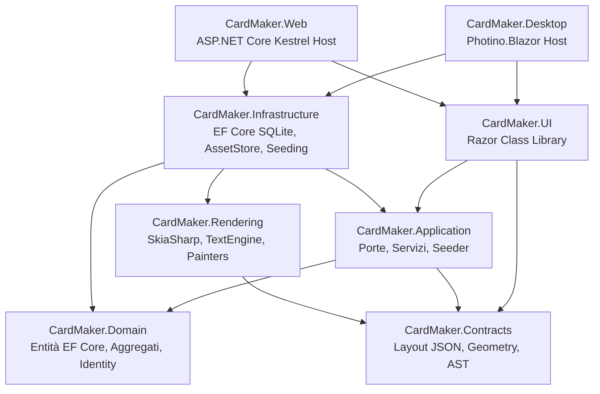

# Project Context — Master Overview

> **Documento di contesto primario per sviluppatori e sessioni AI.**  
> Fornisce un quadro completo, coerente e compatto dell'intero sistema CardMaker, permettendo a qualsiasi nuova sessione di comprendere architettura, stack, flussi e decisioni senza necessità di storico pregresso.

---

## 1. Project Purpose (Scopo del Progetto)

**CardMaker** è una piattaforma *data-driven* ad altissima fedeltà per la progettazione, composizione, rendering raster/vettoriale ed esportazione di carte collezionabili (TCG).

Il principio architetturale fondante è:
> **Nessun asset grafico proprietario è distribuito o generato a codice.**  
> Frame, simboli, font, illustrazioni e texture vengono caricati esclusivamente dall'amministratore. Il software implementa un **unico motore di rendering data-driven** che interpreta layout dichiarativi JSON, rendendo il sistema capace di supportare qualsiasi gioco di carte (esistente o inventato) senza scrivere nuovo codice applicativo o ricompilare.

---

## 2. Project Scope (Ambito del Progetto)

### In Scope (v1 & v2 Completate)
- Supporto nativo calibrato per 3 universi TCG:
  - **Yu-Gi-Oh!** (formato Japanese 59 × 86 mm, inclusi Rush Duel, Pendulum, Link, Token, Skill e Maximum).
  - **Pokémon TCG** (formato Standard Poker 63 × 88 mm: Base, Fasi, EX, GX, V, VMAX, Trainer, Energie).
  - **Magic: The Gathering** (formato Standard Poker 63 × 88 mm: Creature, Planeswalker, Istantanei, Stregonerie, Incantesimi, Artefatti, Terre).
- Motore di rendering tipografico vettoriale e raster basato su **SkiaSharp** a 150, 300 e 600 DPI.
- Sistema a piena abbondanza tipografica (*Full-Bleed 2 mm*) con *Trim Box* e *Safe Zone (3 mm)*.
- Editor WYSIWYG per template (`/admin/templates/{id}`) con albero layer polimorfi, condizioni logiche `VisibleWhen` e griglie di allineamento.
- Form dinamico con validazione automatica generato a partire dallo schema dei campi (`FieldDefinition`).
- Doppia piattaforma nativa:
  - **Desktop**: host autonomo **Photino.Blazor** (Linux WebKitGTK, Windows WebView2, macOS WebKit) con storage locale e bypass admin offline.
  - **Web**: host multiutente **ASP.NET Core / Blazor Server** con registrazione a invito, protezione CSP restrittiva e rate limiting.
- Generatori procedurali di segnaposto grafici e glifi SVG/Skia (simboli energia Pokémon e mana MTG).
- Esportazione in formato **PNG**, **JPEG** e **PDF** a 600 DPI, fronte singolo o fronte/retro combinato.

### Out of Scope (Attuale)
- Generazione massiva/batch automatizzata da fogli CSV/Excel.
- Social network, galleria pubblica, marketplace o condivisione tra account.
- Motore di regole di gioco, simulatore di partite, deck building o calcolo statistiche.
- Generazione automatica di artwork tramite modelli di intelligenza artificiale.
- App mobile nativa (iOS/Android).
- Preparazione per stampa offset commerciale in quadricromia CMYK o crocini di registro manuali (output rigorosamente sRGB tipografico).

---

## 3. Main Components (Componenti Principali)



1. **CardMaker.Domain**: Aggregati di dominio (`Card`, `Game`, `CardType`, `CardTemplate`, `Asset`, `FontAsset`, `Invitation`, `AuditLogEntry`).
2. **CardMaker.Contracts**: Modello geometrico universale (`CardGeometry`), AST condizionale (`ConditionOps`, `ConditionGroup`), schema layout (`CardTemplateLayout`) e binder (`ValueBinder`).
3. **CardMaker.Application**: Interfacce di servizio (*Ports*), logica applicativa, validatori (`UploadValidator`), seeder e gestione valori derivati (`CardDerivedValuesService`).
4. **CardMaker.Rendering**: Motore grafico puro SkiaSharp. Include `CardRenderer` decomposto in 6 `ILayerPainter`, `TextEngine` con auto-fit e centraggio ottico su `CapHeight`, generatori procedurali e `PdfExporter`.
5. **CardMaker.Infrastructure**: Implementazione persistenza (EF Core SQLite con WAL), asset store content-addressed (SHA-256), font catalog e snapshot database.
6. **CardMaker.UI**: Libreria di componenti Razor (RCL) condivisa tra Web e Desktop, contenente pagine utente, studio template e token CSS del Design System.
7. **CardMaker.Desktop**: Host desktop leggero multipiattaforma basato su Photino.Blazor con configurazione percorsi di sistema cross-platform.
8. **CardMaker.Web**: Host web Kestrel con middleware di sicurezza, rate limiting sliding window e header CSP conformi.

---

## 4. Technology Stack (Stack Tecnologico)

- **Linguaggio & Framework**: C# 13 su **.NET 10** (`net10.0`). Solution in formato moderno `CardMaker.slnx`.
- **Libreria Grafica 2D**: **SkiaSharp 4.151.1** e **SkiaSharp.HarfBuzz 4.151.1**.
- **Persistenza Dati**: **Entity Framework Core 10.0.11** con provider **SQLite** in modalità WAL (*Write-Ahead Logging*).
- **Interfaccia Utente**: **Blazor** (Server-side interattivo per Web, in-process WebView per Desktop via Photino).
- **Framework CSS**: **Bootstrap 5.3.3** con design system personalizzato basato su token CSS variabili (`data-bs-theme`).
- **Autenticazione**: **ASP.NET Core Identity** con archiviazione SQLite (Cookie authentication per Web, in-process local bypass per Desktop).
- **Containerizzazione & Reverse Proxy**: Dockerfile multi-stage con Caddy Server e gestione automatica TLS.
- **Testing**: **xUnit 2.9.3**, runner Visual Studio 3.1.4 e **Coverlet 6.0.4**.

---

## 5. Solution Structure (Struttura della Solution)

```text
CardMaker.slnx
├── src/
│   ├── CardMaker.Domain/          # Livello più interno: entità, enum e costrutti di dominio
│   ├── CardMaker.Contracts/       # DTO, layout JSON, geometrie millimetriche e AST
│   ├── CardMaker.Application/     # Contratti dei servizi applicativi, validazione, seeding
│   ├── CardMaker.Rendering/       # Motore di disegno SkiaSharp, Strategy Painters, TextEngine
│   ├── CardMaker.Infrastructure/  # EF Core, SQLite, filesystem storage SHA-256, seeder grafi
│   ├── CardMaker.UI/              # Razor Class Library con tutti i componenti grafici e stili
│   ├── CardMaker.Desktop/         # Host Photino.Blazor per Linux, Windows e macOS
│   └── CardMaker.Web/             # Host ASP.NET Core per pubblicazione web
├── tests/
│   ├── CardMaker.Rendering.Tests/   # 107 test: geometrie, rasterizzazione, auto-fit, regressione
│   └── CardMaker.Application.Tests/ # 93 test: lifecycle, servizi, storage, hardening, smoke DI
├── scripts/                       # Script di automazione (generazione asset branding)
└── docs/                          # Knowledge Base centrale di documentazione
```

---

## 6. Major Libraries (Librerie Principali)

| Libreria | Versione | Scopo |
|---|---|---|
| `SkiaSharp` | 4.151.1 | Rendering grafico 2D hardware-accelerated, export PNG, JPG, PDF |
| `SkiaSharp.HarfBuzz` | 4.151.1 | Modellazione tipografica complessa e misurazione glifi |
| `Microsoft.EntityFrameworkCore.Sqlite` | 10.0.11 | ORM e persistenza relazionale SQLite |
| `Microsoft.AspNetCore.Identity.EntityFrameworkCore` | 10.0.11 | Gestione utenti, ruoli e token di autenticazione |
| `Photino.Blazor` | 4.0.13 | Shell desktop cross-platform nativa senza overhead Node/Electron |

---

## 7. Desktop Application (Applicazione Desktop)

- **Host Tecnico**: `CardMaker.Desktop` sfrutta **Photino.Blazor** (involucro leggero in C++ / C# su WebKitGTK per Linux, WebView2 per Windows, WKWebView per macOS).
- **Percorsi Dati di Sistema**:
  - Linux: `~/.local/share/CardMaker/`
  - Windows: `%LOCALAPPDATA%\CardMaker\`
  - macOS: `~/Library/Application Support/CardMaker/`
- **Autenticazione Offline**: Implementata tramite `DesktopAuthenticationStateProvider` (ADR-009, ADR-031), che garantisce l'accesso immediato con ruolo `Admin` senza richiedere login o connessione di rete.
- **Integrazione Desktop**: Script `run-desktop.sh` registra automaticamente le icone FreeDesktop in `~/.local/share/icons/hicolor/` e il lanciatore `.desktop`.
- **File I/O**: Accesso diretto e concorrente al filesystem locale con supporto a salvataggio file nativo.

---

## 8. Web Application (Applicazione Web)

- **Host Tecnico**: `CardMaker.Web` basato su **ASP.NET Core Kestrel** (porta di default `http://localhost:5240`).
- **Registrazione a Invito**: Accesso ristretto a una cerchia controllata (~10 utenti) tramite `InvitationService` e token SHA-256 monouso con scadenza temporale.
- **Hardening di Sicurezza**:
  - Content Security Policy (CSP) restrittiva: `default-src 'self'`, script e stili vincolati, zero `eval`.
  - Protezione antiforgery su tutti i form.
  - Rate limiting basato su sliding window per mitigare attacchi brute-force e DoS.
- **Health Check**: Endpoint `/healthz` conforme per probe container o proxy esterni.

---

## 9. Database

- **Motore**: **SQLite 3** integrato via Microsoft.Data.Sqlite ed EF Core.
- **Journal Mode**: Rigorosamente **WAL** (*Write-Ahead Logging*) per consentire letture concorrenti non bloccanti durante scritture.
- **Snapshot Online**: Endpoint e servizio di backup basati sul comando nativo `VACUUM INTO`, che genera copie consistenti e verificate tramite `PRAGMA integrity_check` senza arrestare il servizio.
- **Inizializzazione**: `DatabaseInitializer` applica automaticamente le migrazioni all'avvio ed esegue il seeding idempotente di utenti, giochi, font e template.

---

## 10. Filesystem & Storage

- **Asset Store Content-Addressed**: Gli asset binari (immagini, texture, sfondi) sono salvati nella cartella `assets/` su percorsi derivati dal loro hash SHA-256 (es. `assets/ab/cd/abcdef...bin`).
  - Impossibilità strutturale di attacchi di tipo *Path Traversal*.
  - Deduplicazione automatica dei file identici.
  - Pulizia sicura tramite `SafeDeleteAssetAsync` con verifica preventiva dei riferimenti attivi in tutti i template e carte.
- **Font Catalog**: I font tipografici (`.ttf`, `.otf`) sono memorizzati nello storage locale, registrati in `FontRegistry` e indicizzati per alias di ruolo.

---

## 11. External Integrations (Integrazioni Esterne)

- **Nessuna dipendenza cloud obbligatoria**: L'applicazione è autonoma e non richiede API terze per il suo funzionamento primario.
- **Integrazione Tipografica Web**: In anteprima web i font sono serviti come data URI o endpoint `/api/assets/` dedicati con intestazioni di cache immutabili.
- **Caddy Web Server**: Configurazione inclusa (`Caddyfile`) per terminazione TLS automatica Let's Encrypt in reverse proxy su Kestrel.

---

## 12. Testing

- **Copertura Completa**: **200 test automatizzati** eseguiti con `dotnet test CardMaker.slnx`:
  - **`CardMaker.Rendering.Tests` (107 test)**: validazione geometrica millimetrica, mapping pixel a 150/300/600 DPI, test di regressione del `TextEngine`, rasterizzazione strategy painters, token parsing `{sym:...}`.
  - **`CardMaker.Application.Tests` (93 test)**: ciclo di vita carte E2E, seeder multi-gioco, filtri di sicurezza upload, storage content-addressed, smoke test di dependency injection per host Desktop e Web.
- **Zero Warnings**: Configurazione `TreatWarningsAsErrors = true` applicata a tutta la solution.

---

## 13. Performance

- **Pipeline Asincrona 60 FPS**: Operazioni intensive su CPU (rendering raster SkiaSharp) e database (query EF Core) sono incapsulate in chiamate `Task.Run`, mantenendo il thread Blazor/WebKit fluido e reattivo.
- **Cache Multilivello**:
  - `IDecodedImageCache`: cache LRU in-memory delle bitmap Skia decodificate con protezione del ciclo di vita (`disposeOnEviction: false`).
  - Cache dei template layout parsati e delle collezioni di font.
  - Data URI caching con `IMemoryCache` nell'host Desktop.
- **Logging Pulito**: IPC di Photino configurato con `SetLogVerbosity(0)`, azzerando lo spam di dump Base64 in console e adottando prefissi strutturati (`[Preview]`, `[Export]`, `[Card]`, `[Asset]`).

---

## 14. Configuration (Configurazione)

- Gerarchia standard ASP.NET Core: `appsettings.json` → `appsettings.{Environment}.json` → Variabili d'ambiente.
- Sezioni chiave:
  - `ConnectionStrings:DefaultConnection`: percorso del database SQLite.
  - `Storage:DataRoot`: cartella radice per database, asset e font.
  - `Bootstrap:AdminEmail` / `Bootstrap:AdminPassword`: credenziali per il seed iniziale dell'amministratore.

---

## 15. Deployment (Distribuzione)

- **Desktop**: Eseguibile compilato standalone o avviabile con `./run-desktop.sh` (Linux/macOS) o `run-desktop.bat` (Windows).
- **Web**: Container Docker multi-stage (`Dockerfile`) con runtime ASP.NET Core 10 su Alpine/Debian, gestito tramite `docker-compose.yml` e reverse proxy Caddy (`Caddyfile`).

---

## 16. Important Constraints (Vincoli Fondamentali)

1. **Parità Assoluta Anteprima/Export**: L'anteprima live a schermo e l'esportazione a 600 DPI condividono lo stesso identico codice di rendering (`CardRenderer`), garantendo totale fedeltà visiva (ADR-003).
2. **Nessun Motore di Scripting**: Le condizioni logiche sono espresse come AST JSON tipizzato (`ConditionGroup`), prevenendo vulnerabilità di *Remote Code Execution* (ADR-006).
3. **Immutabilità dei Template**: Le versioni dei template pubblicati sono immutabili. Modifiche a un template generano una nuova versione; le carte esistenti rimangono legate alla versione con cui sono state create (ADR-007).
4. **Spazio Colore sRGB**: Tutti i calcoli e gli output sono gestiti nello spazio colore sRGB standard (nessun supporto CMYK per design deliberato).

---

## 17. Known Issues & Important Decisions

- **WebKitGTK su Linux**: Non supporta il download manager standard dei browser web quando si attiva un link `<a download>`; il salvataggio file su Desktop deve avvenire tramite canali nativi di filesystem o dialoghi di sistema (`zenity` / `PhotinoWindow.ShowSaveFileAsync`).
- **Font Web**: Il motore di rendering SkiaSharp supporta nativamente solo font OpenType/TrueType (`.ttf`, `.otf`); i font compressi `.woff2` vengono rifiutati in fase di upload dall'`UploadValidator`.
- **Registro ADR**: Le 38 decisioni architetturali registrate sono consultabili in dettaglio nella cartella [`docs/09-decisions/`](../09-decisions/README.md).
