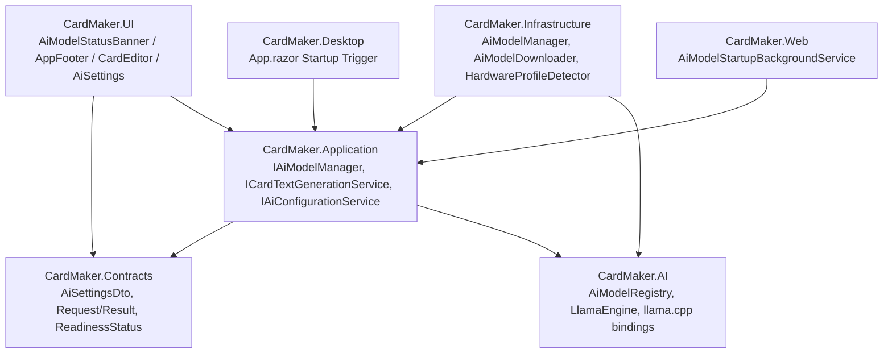
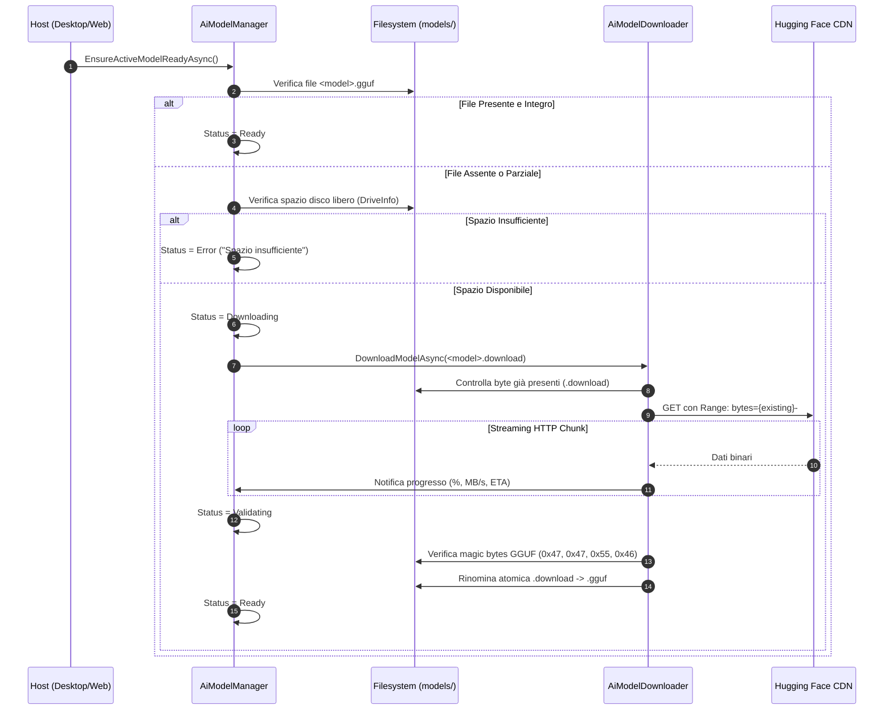

# Architettura del Motore AI Locale — CardMaker.AI

CardMaker integra un motore di intelligenza artificiale generativa **completamente locale e offline**, basato su `llama.cpp` ed eseguito direttamente sulla CPU del dispositivo utente, senza dipendenze cloud o invio di dati all'esterno.

Il modulo è incapsulato nella libreria dedicata **`CardMaker.AI`**, progettata per supportare la generazione di testo (titoli e descrizioni per carte collezionabili) e predisposta architetturalmente per future estensioni multimodali (es. generazione o elaborazione di immagini).

---

## 1. Principi Fondamentali

1. **Zero Cloud, Massima Privacy**: Nessun dato, prompt o contenuto di gioco abbandona la macchina dell'utente. Tutto il calcolo avviene in-process o via binding nativi `llama.cpp`.
2. **Nessun Overhead Prematuro della RAM (0 MB a Riposo)**: Il modello GGUF viene caricato in memoria esclusivamente durante l'operazione di inferenza e rilasciato (`Dispose`) immediatamente dopo il completamento della generazione.
3. **Selezione Intelligente del Modello**: Scelta automatica della variante di modello ottimale in base alla RAM fisica del dispositivo (Gemma 2 / Gemma 3 in quantizzazione GGUF a 4-bit).
4. **Download Automatico Non Bloccante**: Se il modello selezionato non è presente nel disco locale, l'applicazione avvia il download in background all'avvio con supporto al resume HTTP (`Range`) e validazione di integrità.
5. **Robustezza dei Prompt e Fallback JSON**: Garanzia di output strutturato in formato JSON `{ "title": "...", "description": "..." }` con parser difensivo ed estrazione regex.

---

## 2. Struttura del Componente



---

## 3. Matrice Modelli Supportati (Google Gemma)

Tutti i modelli predefiniti appartengono alla famiglia **Gemma** di Google, distribuiti in formato quantizzato `Q4_K_M` per bilanciare velocità di inferenza su CPU e fedeltà semantica:

| Modello | ID | Parametri | RAM Minima | RAM Consigliata | Dimensione GGUF | Spazio Libero Richiesto |
|---|---|---|---|---|---|---|
| **Gemma 2 2B Instruct** | `gemma-2-2b` | 2.6B | 4 GB | 8 GB | ~1.6 GB | 2.5 GB |
| **Gemma 3 4B Instruct** | `gemma-3-4b` | 4.3B | 8 GB | 16 GB | ~2.5 GB | 4.0 GB |
| **Gemma 2 9B Instruct** | `gemma-2-9b` | 9.2B | 16 GB | 32 GB | ~5.4 GB | 8.0 GB |
| **Gemma 2 27B Instruct** | `gemma-2-27b` | 27.2B | 32 GB | 64 GB | ~16.0 GB | 24.0 GB |

### Rilevamento RAM e Selezione Automatica
All'avvio, `HardwareProfileDetector` interroga il sistema operativo:
- **Windows**: API Win32 `GlobalMemoryStatusEx` (`kernel32.dll`).
- **Linux**: Lettura e parsing di `/proc/meminfo` (`MemTotal:` e `MemAvailable:`).

In assenza di override amministrativo manuale, `AiModelRegistry.SelectBestModelForHardware(ramGb)` assegna il modello più capace supportato dalla memoria installata.

---

## 4. Ciclo di Vita e Download Automatico

Lo stato del modello AI è descritto dall'enum `AiModelReadinessStatus`:
- `Disabled`: Funzionalità AI disattivata nelle impostazioni.
- `Checking`: Verifica presenza e integrità del file su disco.
- `Downloading`: Download in streaming HTTP asincrono in background.
- `Validating`: Controllo dimensione e magic bytes GGUF.
- `Ready`: Modello validato e pronto per l'inferenza.
- `Error`: Errore di connessione, spazio insufficiente o file non valido.

### Flusso di Startup e Download con Resume


### Caratteristiche del Downloader (`AiModelDownloader`)
- **File Temporaneo**: I chunk vengono scritti in `<storage>/models/<model>.download`.
- **Ripristino Interruzioni (Resume)**: Se il download è stato interrotto o il programma chiuso, l'intestazione HTTP `Range: bytes={offset}-` permette di ripartire dall'ultimo byte salvato senza riscaricare l'intero file.
- **Retry con Backoff Esponenziale**: In caso di anomalie di rete momentanee, fino a 3 tentativi con ritardo scalato.
- **Validazione Magic Bytes**: Prima di rinominare in `.gguf`, vengono letti i primi 4 byte del file per confermare la firma esadecimale `47 47 55 46` (`GGUF`).
- **Annullamento Utente**: Supporto a `CancellationToken` reattivo dal banner UI.

---

## 5. Inferenza Testuale e Prompt Engineering

Il servizio `CardTextGenerationService` compone prompt specializzati e restrittivi per l'inferenza:

### Vincoli del Prompt
- **Lingua**: Richiesta tassativa in lingua italiana.
- **Contesto di Gioco**: Integrazione delle regole e convenzioni di Yu-Gi-Oh!, Pokémon TCG o MTG.
- **Stile Personalizzato**: Modalità `Neutral`, `Epic`, `Dark`, `Comic`, `Poetic`, `LoreRich`.
- **Formato Risposta**: Esclusivamente un blocco JSON con due chiavi:
  ```json
  {
    "title": "Nome della carta",
    "description": "Effetto o testo narrativo della carta..."
  }
  ```

### Sanitizzazione e Parsing Difensivo
Gli LLM quantizzati possono talvolta includere testo conversazionale prima o dopo il blocco JSON. La funzione `ParseAiJsonOutput` garantisce robustezza attraverso una procedura a due stadi:
1. Tentativo di parsing diretto con `JsonDocument.Parse`.
2. In caso di fallimento, estrazione regex del blocco delimitato da parentesi graffe `\{[\s\S]*\}`.
3. Rimozione di blocchi markdown triple-backtick (```json ... ```).

---

## 6. Integrazione UI e Feedback Visivo

1. **`AiModelStatusBanner.razor`**:
   - Visualizzato in cima al layout (`DesktopMainLayout` e `MainLayout`).
   - Mostra la percentuale di avanzamento, megabyte trasferiti, velocità (MB/s), stima del tempo rimanente (ETA).
   - Pulsanti di azione: **Interrompi** e **Riprova**.
2. **`AppFooter.razor`**:
   - Mostra lo stato di readiness e la percentuale del download in corso.
   - Mostra la versione del motore AI utilizzato: `llama.cpp (CardMaker.AI 1.0.0 / LLamaSharp 0.27.0)`.
3. **`CardEditor.razor`**:
   - Pulsante "✨ Genera con AI" contestuale e reattivo:
     - Se `Downloading` o `Checking`: spinner di caricamento e badge indicatore.
     - Se `Ready`: apre il modal di generazione con selezione stile e preview del risultato prima dell'applicazione.
     - Se `Disabled` o `Error`: tooltip esplicativo con rimando alle impostazioni.
4. **`AiSettings.razor` (`/admin/ai`)**:
   - Panoramica hardware con RAM rilevata e modello consigliato.
   - Selezione del modello attivo (con override manuale).
   - Configurazione parametri: Temperatura, Max Tokens, Context Window, Thread CPU.
   - Pulsante di verifica manuale e forzatura download.

---

## 7. Configurazione e Storage

I parametri AI sono archiviati in formato JSON su filesystem locale:
- **Percorso file**: `<Storage:DataRoot>/ai-settings.json`
- **Cartella modelli GGUF**: `<Storage:DataRoot>/models/`

Esempio di configurazione:
```json
{
  "Enabled": true,
  "SelectedModelId": "gemma-2-2b",
  "Temperature": 0.7,
  "MaxTokens": 256,
  "ContextTokens": 2048,
  "AutoDownloadOnStartup": true,
  "ThreadCount": 4
}
```

---

## 8. Considerazioni di Manutenibilità e Test

- **Isolamento Dipendenze**: Nessun codice Blazor o ASP.NET dipende direttamente da `LLamaSharp`. Tutto il codice native-interop è confinato in `CardMaker.AI`.
- **Suite di Test Dedicata**: 37 test automatici in `tests/CardMaker.Application.Tests/Ai/`:
  - `AiModelDownloaderTests`: simulazione HTTP range, ripresa da offset parziale, retry e validazione magic bytes GGUF.
  - `AiModelManagerTests`: gestione transizioni di stato e thread safety dei trigger.
  - `HardwareProfileDetectorTests`: verifica lettura RAM.
  - `CardTextGenerationServiceTests`: validazione prompt e sanitizzazione output JSON sporco.
  - `AiConfigurationServiceTests`: serializzazione/deserializzazione atomica delle impostazioni.

