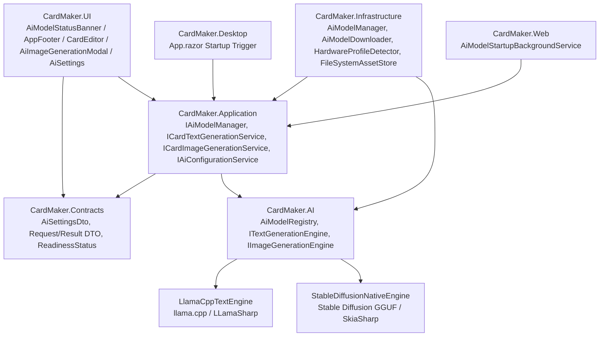
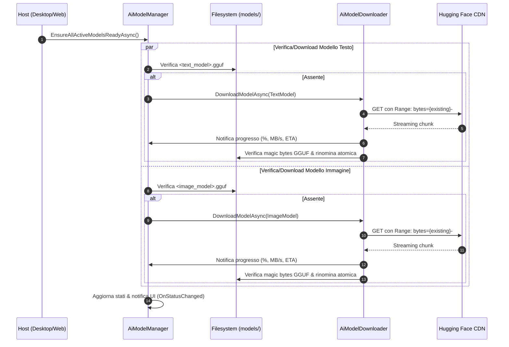

# Architettura del Motore AI Locale — CardMaker.AI

CardMaker integra un motore di intelligenza artificiale generativa multimodale **completamente locale e offline**, basato su architetture open-weight per Large Language Models (`llama.cpp` / Google Gemma) e Diffusion Models (Stable Diffusion in formato GGUF), eseguito direttamente sull'hardware dell'utente senza dipendenze cloud né trasmissione di dati all'esterno.

Il modulo è incapsulato nella libreria dedicata **`CardMaker.AI`**, disaccoppiata dall'interfaccia utente e dalla persistenza attraverso astrazioni conformi alla *Clean Architecture*.

---

## 1. Principi Fondamentali

1. **Zero Cloud, Massima Privacy**: Nessun prompt, testo generato o artwork abbandona il dispositivo dell'utente. Tutto il calcolo avviene in-process o via binding nativi locali.
2. **Nessun Overhead Prematuro della RAM (0 MB a Riposo)**: I modelli GGUF (sia testo che diffusione) vengono caricati in memoria esclusivamente durante la sessione di generazione e deallocati deterministicamente (`Dispose`) alla chiusura del modale o al termine dell'operazione.
3. **Selezione Hardware Automatica**: Rilevamento automatico della memoria RAM installata e assegnazione del profilo ottimale sia per i modelli linguistici (Gemma) sia per i modelli di diffusione (Stable Diffusion).
4. **Download Automatico Non Bloccante con Resume**: All'avvio dell'applicazione (`CardMaker.Desktop` o `CardMaker.Web`), il sistema verifica la presenza dei modelli attivi e ne avvia il download asincrono in background via HTTP Range (`Range: bytes={offset}-`) con validazione di integrità dei magic bytes GGUF.
5. **Robustezza dei Prompt e Fallback JSON**: Garanzia di output strutturato in formato JSON `{ "title": "...", "description": "...", "attack": "...", "defense": "..." }` con parser difensivo ed estrazione regex.
6. **Integrazione Immediata con il Dominio**: I testi generati popolano direttamente i campi della carta rispettandone il tipo (es. Mostro Normale o Effetto), mentre le illustrazioni generate vengono automaticamente convertite in PNG, registrate nel catalogo asset (`IAssetCatalog`) con indirizzamento SHA-256 e collegate all'artwork della carta.

---

## 2. Struttura del Componente



### Separazione delle Responsabilità
- **`CardMaker.AI`**: Contiene i contratti dei motori (`ITextGenerationEngine`, `IImageGenerationEngine`), il registro immutabile dei profili modello (`AiModelRegistry`, `AiModelDefinition`), le sessioni native e gli algoritmi di inferenza pura.
- **`CardMaker.Application`**: Orchestrazione ad alto livello (`IAiModelManager`, `ICardTextGenerationService`, `ICardImageGenerationService`, `IAiConfigurationService`), prompt expansion per gioco e stile artistico, persistenza delle immagini come asset di dominio.
- **`CardMaker.Infrastructure`**: Downloader HTTP resiliente con supporto al resume (`AiModelDownloader`), rilevamento RAM del sistema operativo (`HardwareProfileDetector`), salvataggio su file system locale (`ai-settings.json`).
- **`CardMaker.UI`**: Componenti visivi reattivi per Blazor (`AiModelStatusBanner`, `AppFooter`, `AiImageGenerationModal`, `AiSettings`).

---

## 3. Matrice Modelli Supportati

Tutti i modelli predefiniti sono distribuiti nel formato aperto ad alte prestazioni **GGUF**, consentendo l'inferenza sia su CPU che con accelerazione GPU (CUDA, Vulkan, DirectML, Metal).

### 📝 A. Modelli di Generazione Testo (Google Gemma)

| Modello | Chiave | Parametri | Quantizzazione | RAM Minima | RAM Consigliata | Dimensione GGUF | Spazio Libero Richiesto |
|---|---|---|---|---|---|---|---|
| **Gemma 2 2B Instruct** | `gemma-2-2b` | 2.6B | `Q4_K_M` | 4 GB | 8 GB | ~1.7 GB | 2.5 GB |
| **Gemma 3 4B Instruct** | `gemma-3-4b` | 4.3B | `Q4_K_M` | 8 GB | 16 GB | ~2.5 GB | 4.0 GB |
| **Gemma 2 9B Instruct** | `gemma-2-9b` | 9.2B | `Q4_K_M` | 16 GB | 32 GB | ~5.8 GB | 8.0 GB |
| **Gemma 2 27B Instruct** | `gemma-2-27b` | 27.2B | `Q4_K_M` | 32 GB | 64 GB | ~16.6 GB | 24.0 GB |

### 🎨 B. Modelli di Generazione Illustrazioni (Stable Diffusion)

| Modello | Chiave | Famiglia | Quantizzazione | RAM Minima | Risoluzione Default | Step Consigliati | Dimensione GGUF | Note Operative |
|---|---|---|---|---|---|---|---|---|
| **Stable Diffusion 1.5 Turbo** | `sd-1.5-turbo` | StableDiffusion | `Q8_0` | 4 GB | 512 × 512 px | 4 step | 2.02 GB | Velocità fulminea su CPU/GPU a basse risorse (1-4 step). |
| **DreamShaper 8 SD 1.5 LCM** | `dreamshaper-8` | StableDiffusion | `IQ4_NL` | 8 GB | 512 × 512 px | 8 step | 1.57 GB | Ottimizzato per illustrazioni fantasy, mostri e creature TCG. |
| **SDXL Lightning 4-Step** | `sdxl-lightning-4step` | StableDiffusionXL | `Q4_0` | 16 GB | 768 × 768 px | 4 step | 2.58 GB | Altissima fedeltà artistica e risoluzione nativa 768px. |

### Rilevamento Hardware e Risoluzione Automatica
All'avvio, `HardwareProfileDetector` interroga il sistema operativo:
- **Windows**: API Win32 `GlobalMemoryStatusEx` (`kernel32.dll`).
- **Linux**: Lettura e parsing di `/proc/meminfo` (`MemTotal:` e `MemAvailable:`).

I metodi statici `AiModelRegistry.ResolveRecommendedModel` e `AiModelRegistry.ResolveRecommendedImageModel` assegnano i modelli ottimali quando la configurazione è impostata su `"Auto"`:
- **< 7 GB RAM**: `gemma-2-2b` + `sd-1.5-turbo`
- **7 – 13 GB RAM**: `gemma-3-4b` + `dreamshaper-8`
- **14 – 29 GB RAM**: `gemma-2-9b` + `sdxl-lightning-4step`
- **≥ 30 GB RAM**: `gemma-2-27b` + `sdxl-lightning-4step`

---

## 4. Ciclo di Vita e Download Automatico Unificato

Lo stato del modello AI è descritto dall'enum `AiModelReadinessStatus`:
- `Disabled`: Funzionalità AI disattivata nelle impostazioni.
- `Checking`: Verifica presenza e integrità del file su disco.
- `Downloading`: Download in streaming HTTP asincrono in background.
- `Validating`: Controllo dimensione e magic bytes GGUF.
- `Ready`: Modello validato e pronto per l'inferenza.
- `Error`: Errore di connessione, spazio insufficiente o file non valido.

### Flusso di Startup Concorrente (`EnsureAllActiveModelsReadyAsync`)


### Caratteristiche del Downloader (`AiModelDownloader`)
- **File Temporaneo**: I chunk vengono scritti in `<storage>/models/<model>.download`.
- **Ripristino Interruzioni (Resume)**: Se il download è stato interrotto o il programma chiuso, l'intestazione HTTP `Range: bytes={offset}-` permette di ripartire dall'ultimo byte salvato senza riscaricare l'intero file.
- **Retry con Backoff Esponenziale**: In caso di anomalie di rete momentanee, fino a 3 tentativi con ritardo scalato.
- **Validazione Magic Bytes**: Prima di rinominare in `.gguf`, vengono letti i primi 4 byte del file per confermare la firma esadecimale `47 47 55 46` (`GGUF`).
- **Annullamento Utente**: Supporto a `CancellationToken` reattivo dal banner UI.

---

## 5. Inferenza Testuale e Prompt Engineering

Il servizio `CardTextGenerationService` (`ICardTextGenerationService`) coordina l'inferenza con il modello linguistico Gemma attivo:

### Parametri e Vincoli del Prompt
- **Regole Specifiche del Gioco**: Il prompt incorpora regole, terminologia e formati canonici del gioco attivo (Yu-Gi-Oh!, Pokémon TCG, Magic: The Gathering).
- **Tipologia di Carta Richiesta**: Il modello rispetta rigidamente la tipologia indicata dall'utente (es. se la richiesta è per un "Mostro Normale", genera lore/flavor text narrativo; se per un "Mostro con Effetto", genera una clausola di effetto con condizioni di attivazione coerenti).
- **Stile Narrativo**: Supporto per stili dedicati: `Classic`, `Mythic`, `Dark`, `Humorous`, `Technical`.
- **Formato Risposta Strutturato**:
  ```json
  {
    "title": "Drago dell'Eclissi Notturna",
    "description": "Una volta per turno: puoi bandire 1 mostro OSCURITÀ dal tuo cimitero per scegliere come bersaglio 1 carta sul terreno; distruggila.",
    "attack": "2500",
    "defense": "2100"
  }
  ```

### Sanitizzazione e Parsing Difensivo
Gli LLM quantizzati possono talvolta includere testo conversazionale prima o dopo il blocco JSON. La funzione `ParseAiJsonOutput` garantisce robustezza attraverso una procedura a due stadi:
1. Tentativo di parsing diretto con `JsonDocument.Parse`.
2. In caso di fallimento, estrazione regex del blocco delimitato da parentesi graffe `\{[\s\S]*\}`.
3. Rimozione preventiva di blocchi markdown triple-backtick (```json ... ```).

### Popolamento Automatico nell'Editor
All'accettazione del testo generato da parte dell'utente, `CardEditor` applica direttamente i valori alla carta:
- Nome/Titolo della carta
- Descrizione o Effetto
- Tipo di Carta (garantito coerente con la tipologia richiesta)
- Attacco e Difesa (per carte mostro/creatura con statistiche numeriche)

---

## 6. Inferenza Immagini e Generazione Artwork

Il servizio `CardImageGenerationService` (`ICardImageGenerationService`) e l'astrazione `IImageGenerationEngine` gestiscono la generazione locale text-to-image delle illustrazioni delle carte:

### Contratto `IImageGenerationEngine`
```csharp
public interface IImageGenerationEngine : IAiModelSession
{
    Task<ImageGenerationResult> GenerateImageAsync(
        string modelPath,
        ImagePromptRequest request,
        int threads = 0,
        IProgress<AiProgressUpdate>? progress = null,
        CancellationToken cancellationToken = default);
}
```

### Flusso Operativo della Generazione Artwork
1. **Richiesta Utente**: L'utente inserisce un prompt descrittivo dell'illustrazione desiderata o precarica automaticamente il titolo e la descrizione della carta attiva.
2. **Preset di Stile Artistico**: L'applicazione include prompt modifiers ottimizzati per il mondo TCG:
   - *Fantasy / TCG Illustrativo*: Dettagli epici, illuminazione volumetrica e rendering digitale da carta collezionabile.
   - *Anime / Manga TCG*: Disegno a linee marcate in stile anime giapponese e cel-shading moderno.
   - *Dark Fantasy & Gothic*: Ombre drammatiche, atmosfera cupa e tonalità spettrali.
   - *Sci-Fi / Cyberpunk*: Estetica futuristica, luci al neon e armature iper-dettagliate.
   - *Dipinto ad Olio*: Pennellate materiche e resa pittorica classica da arte fantasy tradizionale.
   - *Acquerello & Inchiostro*: Tratti a inchiostro e sfumature trasparenti su carta pergamena.
3. **Negative Prompting Specializzato**:
   - Viene iniettato automaticamente un negative prompt restrittivo volto ad escludere artefatti comuni: `card frame, card border, text, watermark, signature, blurry, lowres, distorted anatomy, cropped`.
4. **Campionamento e Risoluzione**:
   - Step rapidi (4-8) calibrati sui modelli Turbo, LCM e Lightning.
   - Risoluzione 512×512 px per SD 1.5 o 768×768 px per SDXL.
   - Seed configurabile (casuale per nuove idee, oppure fisso per riprodurre o perfezionare varianti).
5. **Archiviazione e Binding Automatico**:
   - L'immagine generata viene convertita in formato PNG ad alta densità.
   - Viene registrata nel sistema di storage content-addressed tramite `IAssetCatalog.RegisterUploadedAssetAsync`, garantendo deduplicazione SHA-256 e integrità referenziale.
   - Il nuovo `assetId` generato viene associato istantaneamente al campo `artwork` della carta in fase di modifica, aggiornando l'anteprima 60 FPS in tempo reale.

---

## 7. Integrazione UI e Feedback Visivo

1. **`AiModelStatusBanner.razor`**:
   - Posizionato nella testata dell'applicazione (`DesktopMainLayout` e `MainLayout`).
   - Monitora sia il modello testuale sia il modello di diffusione delle immagini.
   - Visualizza progresso percentuale, megabyte scaricati/totali, velocità di trasferimento (MB/s) ed ETA.
   - Pulsanti di azione dedicati: **Interrompi** e **Riprova**.
2. **`AppFooter.razor`**:
   - Barra di stato inferiore compatta con tipografia calibrata per il minimo ingombro.
   - Espone lo stato di download o prontezza e le versioni dei motori: `llama.cpp (CardMaker.AI / LLamaSharp 0.27.0) • Stable Diffusion GGUF`.
3. **`CardEditor.razor`**:
   - **"✨ Genera Testo con AI"**: modal per la generazione di titolo, tipo, effetto e statistiche.
   - **"🎨 Genera Immagine con AI"**: modal dedicato per l'illustrazione della carta.
   - Indicatori reattivi con spinner di caricamento e disabilitazione preventiva durante la fase di download del modello.
4. **`AiImageGenerationModal.razor`**:
   - Interfaccia visuale completa con anteprima dell'artwork generato.
   - Controlli per Prompt, Negative Prompt, Stile Artistico, Risoluzione, Step e Seed.
   - Azione **"Applica alla Carta"** per il salvataggio immediato e il collegamento alla scheda carta.
5. **`AiSettings.razor` (`/admin/ai`)**:
   - Panoramica hardware del sistema (RAM fisica rilevata, CPU threads).
   - Abilitazione/Disabilitazione indipendente per Text Generation e Image Generation.
   - Selezione del modello attivo (con override manuale o selezione `"Auto"`).
   - Stato dei file su disco con controlli di download forzato o pulizia della cache modelli.

---

## 8. Configurazione e Storage

I parametri AI sono archiviati in formato JSON su filesystem locale:
- **Percorso file**: `<Storage:DataRoot>/ai-settings.json`
- **Cartella modelli GGUF**: `<Storage:DataRoot>/models/`

Esempio di configurazione completa:
```json
{
  "IsEnabled": true,
  "SelectedModelKey": "Auto",
  "IsImageGenerationEnabled": true,
  "SelectedImageModelKey": "Auto",
  "CpuThreads": 0,
  "CustomModelsDirectory": null
}
```

- `IsEnabled`: Flag master per il motore testuale LLM.
- `SelectedModelKey`: Modello linguistico (`"Auto"`, `"gemma-2-2b"`, `"gemma-3-4b"`, `"gemma-2-9b"`, `"gemma-2-27b"`).
- `IsImageGenerationEnabled`: Flag master per la generazione di illustrazioni.
- `SelectedImageModelKey`: Modello di diffusione (`"Auto"`, `"sd-1.5-turbo"`, `"dreamshaper-8"`, `"sdxl-lightning-4step"`).
- `CpuThreads`: Numero di thread CPU per inferenza (0 = auto-detection).
- `CustomModelsDirectory`: Percorso opzionale per cartella modelli esterna su filesystem.

---

## 9. Manutenibilità e Suite di Test

Tutti i componenti sono testati approfonditamente con xUnit:
- **`AiModelDownloaderTests`**: Simulazione HTTP range, ripresa da offset parziale, retry e validazione magic bytes GGUF.
- **`AiModelManagerTests`**: Transizioni di stato reattive, esecuzione concorrente di `EnsureAllActiveModelsReadyAsync`, cancellazione e sincronizzazione thread-safe.
- **`HardwareProfileDetectorTests`**: Rilevamento memoria fisica multipiattaforma (Windows Win32 e Linux `/proc/meminfo`).
- **`CardTextGenerationServiceTests`**: Validazione prompt multigioco, aderenza al tipo carta, parsing JSON difensivo ed estrazione statistiche.
- **`CardImageGenerationServiceTests`**: Risoluzione prompt artistici, applicazione preset stili, gestione seed deterministico e salvataggio asset PNG.
- **`AiConfigurationServiceTests`**: Serializzazione atomica su disco e tolleranza ai file corrotti.

