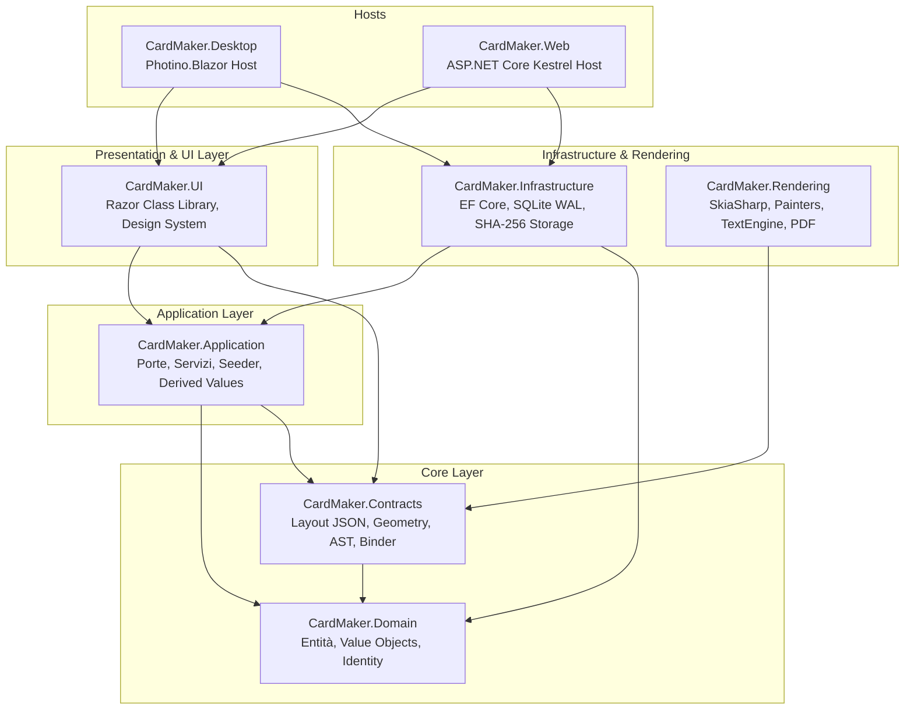

# Architettura Tecnica del Sistema

## 1. Visione d'Insieme e Principi Guida

CardMaker è strutturato secondo i dettami della **Clean Architecture** (architettura esagonale o *Ports & Adapters*).
Tutti i componenti applicativi e di rendering rispettano rigorosamente la regola delle dipendenze: il flusso delle dipendenze punta sempre verso l'interno, proteggendo il modello di dominio e i contratti dalle specificità infrastrutturali e tecnologiche esterne.



### Principi Architetturali Chiave
1. **Unico Motore Data-Driven**: Nessun codice hardcodato per-gioco. Tipi di carta, frame, regole e template sono dati (ADR-001).
2. **Disaccoppiamento Applicazione/Rendering (ARCH-001)**: `CardMaker.Application` e `CardMaker.UI` dipendono unicamente da `CardMaker.Contracts`. Il rendering vero e proprio (`CardMaker.Rendering`) riceve richieste geometriche già risolte.
3. **Parità Assoluta Anteprima ed Export**: L'anteprima web/desktop e l'esportazione ad alta definizione (600 DPI) utilizzano lo stesso identico pipeline e le stesse classi SkiaSharp (ADR-003).
4. **AST Condizionale Tipizzato**: Nessuna valutazione di codice dinamico (`eval`), bensì alberi sintattici JSON sicuri (`ConditionGroup`) (ADR-006).
5. **Storage Content-Addressed**: File binari salvati su filesystem denominati con il loro digest SHA-256 (ADR-005).

---

## 2. Pipeline di Rendering SkiaSharp

Il motore di rendering (`CardMaker.Rendering`) esegue una pipeline deterministica a 6 fasi:

```text
┌──────────────┐     ┌───────────┐     ┌──────────────┐
│  1. RESOLVE  │ ──> │  2. BIND  │ ──> │ 3. EVALUATE  │
└──────────────┘     └───────────┘     └──────────────┘
                                              │
┌──────────────┐     ┌───────────┐            ▼
│   6. POST    │ <── │ 5. PAINT  │ <── ┌──────────────┐
└──────────────┘     └───────────┘     │  4. MEASURE  │
                                       └──────────────┘
```

1. **RESOLVE**: Identificazione della versione del template immutabile (`CardTemplateVersion`) e parsing del documento di layout JSON.
2. **BIND**: Risoluzione delle interpolazioni `{{campo}}` con i valori immessi dall'utente; calcolo dei valori derivati (`CardDerivedValuesService`).
3. **EVALUATE**: Valutazione delle condizioni logiche `VisibleWhen` sull'AST; potatura dei layer che non devono essere renderizzati.
4. **MEASURE**: Misurazione tipografica dei testi con `TextEngine`, calcolo dell'auto-fit (*shrink*, *condense*, *shrink-and-condense*) e risoluzione dei blocchi ad altezza variabile.
5. **PAINT**: Esecuzione del disegno ordinato per Z-index delegato a 6 Strategy Painters specializzati (`ILayerPainter`):
   - `ImageLayerPainter`: disegno frame e illustrazioni artwork con crop geometrico.
   - `TextLayerPainter`: resa tipografica con centraggio ottico calibrato su `CapHeight`.
   - `RichTextLayerPainter`: testo formattato con embedding inline di glifi grafici `{sym:...}`.
   - `SymbolRepeaterLayerPainter`: ripetizione automatica di icone (es. stelle livello o rank).
   - `LinkArrowsLayerPainter`: frecce Link ottagonali orientate per mostri Link.
   - `FoilLayerPainter`: applicazione di texture olografiche e maschere di luminanza.
6. **POST**: Applicazione maschera angoli arrotondati, gestione dell'abbondanza (*bleed*), ritaglio sul *trim box* o *safe zone* e codifica finale nel formato richiesto (PNG, JPEG o PDF vettoriale).

---

## 3. Strategia Multi-Host: Web & Desktop

Una singola Razor Class Library (`CardMaker.UI`) alimenta entrambi gli scenari di deployment:

| Aspetto | Host Web (`CardMaker.Web`) | Host Desktop (`CardMaker.Desktop`) |
|---|---|---|
| **Tecnologia Host** | ASP.NET Core Kestrel | Photino.Blazor (C++ / C#) |
| **Piattaforme** | Server Linux / Container Docker | Windows, macOS, Linux nativo |
| **Motore WebView** | Browser dell'utente | WebKitGTK (Linux), WebView2 (Windows), WKWebView (macOS) |
| **Autenticazione** | Identity Cookie con registrazione a invito | `DesktopAuthenticationStateProvider` (Bypass locale Admin) |
| **Accesso Dati** | In-process server-side con SQLite WAL | In-process locale su percorsi OS standard (`.local/share`, `%LOCALAPPDATA%`) |
| **File I/O** | Download via browser (JSInterop) | Scrittura diretta su disco con finestre di dialogo OS native |
| **Risoluzione URI Asset** | Controller HTTP `/api/assets/{id}` | In-memory Data URI (`data:image/png;base64,...`) |

---

## 4. Modello di Concorrenza e Thread Safety

1. **Offload Asincrono a 60 FPS**: Blazor esegue i cicli di rendering della UI sul thread principale; per evitare qualsiasi lag dell'interfaccia durante anteprime e composizioni pesanti, tutte le operazioni SkiaSharp e le query EF Core sono invocate tramite `Task.Run(...)` (ADR-037).
2. **SQLite in Modalità WAL**: La combinazione di Write-Ahead Logging e pooling previene i lock in scrittura durante le letture concorrenti.
3. **Cache Bitmap Thread-Safe**: `DecodedImageCache` utilizza una coda LRU thread-safe con `disposeOnEviction: false` per impedire che una superficie di disegno acceda a una bitmap dereferenziata.
