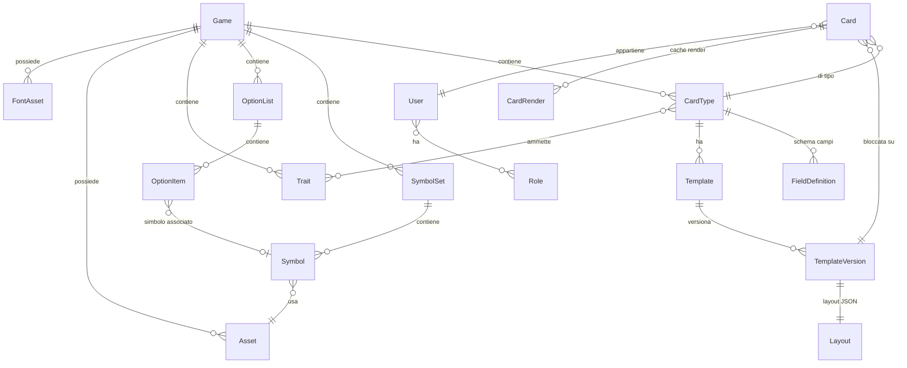

# 03 — Modello dati

## 1. Diagramma delle entità



---

## 2. Entità

### `Game`
| Campo | Tipo | Note |
|---|---|---|
| `Id` | Guid | |
| `Key` | string | slug univoco, es. `yugioh` |
| `Name` | LocalizedText | JSON `{"it":"…","en":"…"}` |
| `WidthMm` / `HeightMm` | decimal | YGO 59 × 86; PKM/MTG 63 × 88 |
| `CornerRadiusMm` | decimal | |
| `BleedMm` | decimal | abbondanza per la stampa |
| `SafeZoneMm` | decimal | margine di sicurezza mostrato nell'editor |
| `DefaultDpi` | int | 600 |
| `DefaultCulture` | string | fallback per i LocalizedText |
| `CardBackTemplateId` | Guid? | template del retro |
| `IsPublished` | bool | i giochi in bozza non appaiono all'utente |

### `Asset`
`Id`, `GameId?`, `Sha256` (**nome del file su disco**), `OriginalFileName`, `MimeType`,
`ByteSize`, `PixelWidth`, `PixelHeight`, `Category` (`frame`, `symbol`, `foil`, `overlay`, `back`,
`mask`, `other`), `Tags` (JSON), `LicenseNote`, `SourceNote`, `UploadedByUserId`, `CreatedAtUtc`.

> Provenienza e licenza sono campi **obbligatori a livello di processo**: servono a documentare che
> l'admin ha il diritto di usare quell'asset.

### `FontAsset`
`Id`, `GameId?`, `AssetId`, **`Alias`** (il ruolo: `card-name`, `effect`, `atk-def-value`…),
`FamilyName`, `StyleName`, `Weight`, `IsItalic`, `LicenseNote`.
Caricato dall'admin (`.ttf`, `.otf`, `.woff2`); nessun font e' distribuito con l'app.

> **`Alias` e' univoco per gioco** ed e' la chiave usata nei layout (`"font": "card-name"`).
> Lo stesso file font puo' essere registrato con piu' alias se copre piu' ruoli.
> Cambiare il font di tutti i nomi carta = ricaricare un file, senza toccare i template.
> L'elenco completo dei ruoli e' in [`06-asset-spec.md` § 9](06-asset-spec.md).

### `SymbolSet` / `Symbol`
- `SymbolSet`: `Id`, `GameId`, `Key` (`attributes`, `spell-properties`, `level-stars`, `link-arrows`…), `Name`.
- `Symbol`: `Id`, `SymbolSetId`, `Key` (`dark`, `quick-play`…), `Name`, `AssetId`, `InlineToken`
  (token usabile nel rich text, es. `{sym:attribute.dark}`), `SortOrder`.

### `OptionList` / `OptionItem`
Enumerazioni gestibili dall'admin senza codice (razze, rarità, edizioni, attributi…).
- `OptionItem`: `Id`, `OptionListId`, `Key`, `Label` (LocalizedText), `SymbolId?`,
  `Metadata` (JSON libero, es. colore del nome per una rarità), `SortOrder`, `IsActive`.

### `Trait`
Specializzazione che non cambia il frame ma influenza testo/regole.
`Id`, `GameId`, `Key` (`tuner`, `toon`, `spirit`…), `Name`, `Group` (`ability`, `summon-method`),
`SortOrder`. Collegato a `CardType` con tabella di associazione (quali traits sono ammessi).

### `CardType`
`Id`, `GameId`, `Key` (`monster-xyz`, `spell`, `link`…), `Name`, `Description`, `IconAssetId?`,
`SortOrder`, `IsPublished`.

### `FieldDefinition` — lo schema che genera il form dell'utente
| Campo | Note |
|---|---|
| `Id`, `CardTypeId`, `Key` | `Key` è ciò che si usa nei binding `{{key}}` |
| `Label`, `HelpText` | LocalizedText |
| `Kind` | `Text`, `MultilineText`, `RichText`, `Integer`, `Decimal`, `Boolean`, `Enum`, `MultiEnum`, `Image`, `Color`, `SymbolRef`, `ToggleSet`, `Computed` |
| `IsRequired`, `DefaultValueJson` | |
| `OptionListId?` | per `Enum`/`MultiEnum` |
| `SymbolSetId?` | per `SymbolRef`/`ToggleSet` |
| `ValidationJson` | `{min, max, maxLength, pattern, allowUnknown}` |
| `ComputedExprJson` | per i campi derivati (type line, LINK-n) |
| `GroupName`, `SortOrder` | organizzazione del form |
| `VisibleWhenJson` | il campo appare solo se una condizione è vera |

### `Template` / `TemplateVersion`
- `Template`: `Id`, `CardTypeId`, `Key`, `Name`, `Face` (`Front` | `Back`), `Orientation`
  (`Portrait` | `Landscape`), `IsDefault`, `SelectionRuleJson` (condizione che decide se questo
  template è quello giusto per i valori inseriti — es. `rarity == "ghost"`).
- `TemplateVersion`: `Id`, `TemplateId`, `VersionNumber`, `Status` (`Draft` | `Published` |
  `Archived`), `LayoutJson`, `ChangeNote`, `CreatedByUserId`, `CreatedAtUtc`, `PublishedAtUtc`.

> **Le versioni pubblicate sono immutabili.** Modificare un template pubblicato crea una nuova bozza.
> Una carta salvata resta legata alla sua `TemplateVersionId`, così non cambia aspetto a sorpresa.
> L'utente può scegliere esplicitamente di "aggiornare alla versione più recente".

### `Card`
`Id`, `OwnerUserId`, `GameId`, `CardTypeId`, `TemplateVersionId`, `BackTemplateVersionId?`,
`Title` (nome per la lista personale), `ValuesJson` (dizionario `key → valore`),
`SelectedTraitsJson`, `ThumbnailAssetId?`, `CreatedAtUtc`, `UpdatedAtUtc`.

### `CardRender` (cache)
`Id`, `CardId`, `CacheKey` (SHA-256 di layout+valori+asset+dpi+formato), `Dpi`, `Format`,
`Face`, `WithBleed`, `AssetPath`, `CreatedAtUtc`, `LastAccessedUtc`. Purgabile.

### Identity
`User` (ASP.NET Identity) + `Role` (`Admin`, `User`). `AuditLog` per le azioni admin
(chi ha caricato/cancellato cosa e quando).
`Invitation`: `Id`, `Email`, `Token` (hash), `Role`, `CreatedByUserId`, `ExpiresAtUtc`, `RedeemedAtUtc`.
Necessaria perché non esiste registrazione libera (l'app è esposta su internet).

---

## 3. Schema del layout (`LayoutJson`)

Il layout è un documento JSON validato da **JSON Schema** prima di essere eseguito.

```jsonc
{
  "schemaVersion": 1,
  "canvas": {
    "widthMm": 59, "heightMm": 86,
    "cornerRadiusMm": 2, "bleedMm": 2, "safeZoneMm": 3,
    "background": "#00000000"
  },
  "textStyles": {
    "cardName": {
      "font": "card-name",
      "sizePt": 26, "color": "#000000",
      "align": "left", "verticalAlign": "middle",
      "lineHeight": 1.0, "letterSpacing": 0, "scaleX": 1.0,
      "transform": "none",
      "autoFit": { "mode": "condense", "minSizePt": 10, "minScaleX": 0.55 }
    },
    "effectText": {
      "font": "effect", "sizePt": 11, "align": "justify",
      "autoFit": { "mode": "shrinkAndCondense", "minSizePt": 6, "minScaleX": 0.7 }
    }
  },
  "computed": [
    { "key": "typeLine",
      "expr": { "op": "join", "sep": "/", "prefix": "[", "suffix": "]",
                "args": ["{{race}}", "{{summonMethod}}", "{{abilities}}", "{{effectFlag}}"] } }
  ],
  "layers": [ /* … */ ]
}
```

> Gli **stili di testo** sono definiti una volta e riusati dai layer con `"style": "cardName"`.
> Un layer puo' sovrascrivere singole proprieta' con `"styleOverrides"`, che e' il meccanismo con cui
> le rarita' cambiano il colore del nome senza duplicare il template.

### 3.1 Proprietà comuni a ogni layer

```jsonc
{
  "id": "5f3c…",
  "name": "Nome carta",
  "type": "text",
  "z": 100,
  "rect": { "x": 0.083, "y": 0.036, "w": 0.72, "h": 0.055 },  // normalizzato 0..1
  "anchor": "topLeft",          // topLeft|top|topRight|left|center|right|bottomLeft|bottom|bottomRight
  "rotationDeg": 0,
  "opacity": 1.0,
  "blendMode": "srcOver",       // srcOver|multiply|screen|overlay|softLight|colorDodge|…
  "clipTo": null,               // id di un layer maschera
  "visibleWhen": null,          // AST condizionale, null = sempre visibile
  "locked": false
}
```

### 3.2 Esempi per tipo

**`staticImage`** — il frame
```jsonc
{ "type": "staticImage", "assetId": "…", "fit": "fill" }   // fit: fill|contain|cover|stretch
```

**`imageSlot`** — artwork dell'utente
```jsonc
{ "type": "imageSlot", "fieldKey": "artwork",
  "fit": "cover", "maskAssetId": null,
  "placeholderAssetId": "…",
  "minSourcePx": { "w": 800, "h": 800 } }   // avvisa l'utente se l'immagine è troppo piccola
```

**`text`** — nome carta con compressione orizzontale (Yu-Gi-Oh!)
```jsonc
{ "type": "text",
  "source": "{{name}}",
  "style": "cardName",
  "styleOverrides": { "color": "#FFFFFF" },   // es. nome bianco sugli Xyz
  "maxLines": 1 }
```

**`richText`** — box effetto
```jsonc
{ "type": "richText",
  "source": "{{effectText}}",
  "font": "effect", "sizePt": 11, "color": "#000000",
  "align": "justify", "valign": "top",
  "lineHeight": 1.06,
  "paragraphSpacing": 0.2,
  "italicWhen": { "op": "eq", "field": "cardType", "value": "monster-normal" },
  "autoFit": { "mode": "shrinkAndCondense", "minFontSize": 6,
               "minScaleX": 0.7, "minLineHeight": 0.92 },
  "symbolScale": 1.0,
  "symbolBaselineOffset": -0.1 }
```

**`symbolSlot`** — attributo
```jsonc
{ "type": "symbolSlot", "symbolSetKey": "attributes", "fieldKey": "attribute", "fit": "contain" }
```

**`symbolRepeater`** — stelle Livello (da destra) / Rank (da sinistra)
```jsonc
{ "type": "symbolRepeater",
  "symbolSetKey": "level-stars", "symbolKey": "level",
  "countField": "level",
  "maxCount": 12,
  "direction": "rtl",          // ltr|rtl
  "spacing": 0.004,            // normalizzato sulla larghezza carta
  "itemSize": { "w": 0.075, "h": 0.052 },
  "wrap": false }
```

**`toggleGroup`** — le 8 frecce Link
```jsonc
{ "type": "toggleGroup",
  "fieldKey": "linkArrows",
  "items": [
    { "key": "topLeft",  "onAssetId": "…", "offAssetId": "…",
      "rect": { "x": 0.055, "y": 0.150, "w": 0.11, "h": 0.075 } },
    { "key": "top",      "onAssetId": "…", "offAssetId": "…", "rect": { … } }
    /* … 8 in totale … */
  ] }
```

**`repeatingBlock`** — attacchi Pokémon (v2)
```jsonc
{ "type": "repeatingBlock",
  "sourceField": "attacks",
  "direction": "vertical",
  "gap": 0.01,
  "distribute": "spaceBetween",   // start|center|spaceBetween|spaceAround
  "itemTemplate": { "minHeight": 0.06, "layers": [ /* layer relativi al blocco */ ] } }
```

**`overlay`** — foil olografico
```jsonc
{ "type": "overlay", "assetId": "…", "blendMode": "screen", "opacity": 0.6,
  "maskAssetId": "…",
  "visibleWhen": { "op": "in", "field": "rarity",
                   "value": ["super", "ultra", "secret", "ghost", "starlight"] } }
```

**`shape`** — riquadro/gradiente
```jsonc
{ "type": "shape", "shape": "roundedRect", "radius": 0.01,
  "fill": { "kind": "linearGradient", "angleDeg": 90,
            "stops": [ { "at": 0, "color": "#FFD54F" }, { "at": 1, "color": "#8BC34A" } ] },
  "border": { "color": "#000000", "widthMm": 0.3 } }
```

---

## 4. Convenzioni

- **Coordinate normalizzate 0..1** rispetto al *trim* della carta (bordo tagliato), non al bleed.
  L'origine `(0,0)` è l'angolo alto-sinistro del trim; l'area di abbondanza usa valori negativi.
- **Dimensioni font in punti tipografici**, convertite in pixel in base al DPI di render.
- **Colori** in `#RRGGBB` o `#RRGGBBAA`.
- **Tutti gli ID** sono GUID; le **chiavi** (`Key`) sono slug minuscoli con trattini, univoci nello scope.
- `schemaVersion` nel layout consente migrazioni future senza rompere i template esistenti.

---

## 5. Seed Yu-Gi-Oh! previsto per la v1

### Formato classico

**17 template fronte:** Normal, Effect, Ritual, Fusion, Synchro, Xyz, Link, Token, Spell, Trap, Skill
+ 6 varianti Pendulum.

### Rush Duel

**8–9 template fronte:** Normal, Effect, Fusion, Maximum-Left, Maximum-Center, Maximum-Right,
Spell, Trap, (Token opzionale).

### Comuni

**2 template retro:** `back-classic`, `back-rush`.

**Set di simboli:** `attributes` (9), `spell-properties` (6), `trap-properties` (3),
`level-stars` (3–4), `link-arrows` (8 × on/off = 16), `holograms`, `editions`, `rush-markers`, `foils`.

**Ruoli font:** 15 alias per il formato classico + 5 per il Rush Duel
(elenco in [`06-asset-spec.md` § 9](06-asset-spec.md)).

**Liste opzioni:** `races` (25), `rarities` (10 + `over-rush-rare`), `editions` (3), `attributes` (9),
`abilities` (7), `summon-methods`, `rush-effect-sections`.

**Campi calcolati:** `typeLine`, `linkRating`, `atkDefLine`, `maximumAtkLine`.

> Il gioco Rush Duel viene modellato come **`CardType` aggiuntivi dentro lo stesso `Game`**
> (stesso formato fisico, stessi attributi e razze), non come gioco separato. In alternativa, se si
> preferisce tenere le due liste di carte separate nell'interfaccia utente, si crea un secondo
> `Game` con chiave `yugioh-rush` che riusa gli stessi asset. **Decisione da prendere in F3.**

### Elenco degli asset necessari

La specifica completa per il grafico (misure, formati, nomi file, priorità) è in
[`06-asset-spec.md`](06-asset-spec.md).
